# Complete Flexbox Guide

## Table of Contents

1. [Your First Flexbox Layout](#1-your-first-flexbox-layout)
2. [Main Axis and Cross Axis](#2-main-axis-and-cross-axis)
3. [Justify Content](#3-justify-content)
4. [Positioning Individual Items](#4-positioning-individual-items)
5. [The Flex Property](#5-the-flex-property)

---

## 1. Your First Flexbox Layout

### File Structure

```
/-index.html
/-index.css
/-basic.css
```

### Initial Setup

The `basic.css` file contains styling unrelated to flexbox itself:

```css
.container > div {
  padding: 10px;
  text-align: center;
  font-size: 2em;
  color: #ffeead;
}

html,
body {
  background-color: #ffeead;
  margin: 10px;
}

.container > div:nth-child(1) {
  background-color: #96ceb4;
}

.container > div:nth-child(2) {
  background-color: #ff6f69;
}

.container > div:nth-child(3) {
  background-color: #88d8b0;
}
```

### HTML Structure (`index.html`)

```html
<html>
  <head>
    <link rel="stylesheet" href="basic.css" />
    <link rel="stylesheet" href="index.css" />
  </head>
  <body>
    <nav class="container">
      <div>Home</div>
      <div>Search</div>
      <div>Logout</div>
    </nav>
  </body>
</html>
```

The markup contains a `nav` element with the class `container`, and inside are three `div` elements which will become **flex items**.

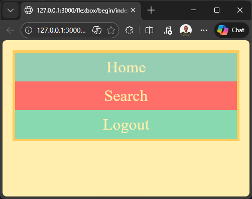

### Key Concepts

**Container and Items:** The fundamental structure of Flexbox requires:

- A **container** (parent element)
- **Items** (direct children of the container)

These don't have to be `div`s or `nav`s—they could be `ul` and `li` elements, or any other combination. As long as they are direct children of the Flexbox container, they become flex items.

### Activating Flexbox

Starting with a simple border on the container:

```css
/* index.css */

.container {
  border: 5px solid #ffcc5c;
}
```


Without any flexbox properties, the `div`s stack vertically by default.

To activate Flexbox, add `display: flex` to the container:

```css
.container {
  border: 5px solid #ffcc5c;
  display: flex;
}
```

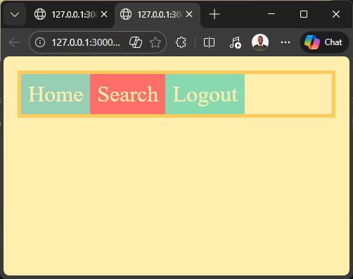

**What Changed:**

- Elements automatically align horizontally instead of vertically
- By default, Flexbox distributes items from left to right
- The Flexbox container is a block element, taking up all available width (minus margins)

---

## 2. Main Axis and Cross Axis

Understanding **axes** is crucial for working with Flexbox, as a Flexbox container always has a **direction**.


### Default Direction (Row)

By default, the direction is horizontal:

- **Main axis:** left to right (along the row)
- **Cross axis:** top to bottom

```css
.container {
  border: 5px solid #ffcc5c;
  display: flex;
  flex-direction: row; /* Default value */
}
```


### Column Direction

You can flip the direction by changing `flex-direction` to `column`:

```css
.container {
  border: 5px solid #ffcc5c;
  display: flex;
  flex-direction: column;
}
```

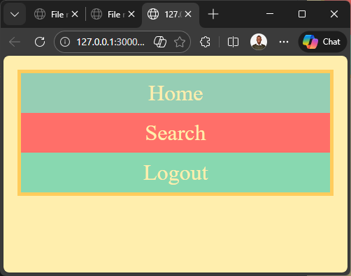

Now:

- **Main axis:** top to bottom
- **Cross axis:** left to right

### Why This Matters

Different CSS properties control positioning along the main axis versus the cross axis. Understanding which axis is which determines which properties you'll use.

**Note:** This guide focuses primarily on `row` direction (the default), as it's more commonly used in practical website development.

---

## 3. Justify Content

The `justify-content` property positions items along the **main axis** (left to right by default, due to the `dir="ltr"` attribute in the HTML tag).


Instead of having items squeezed together on the left, you might want spacing between them or specific positioning (e.g., logout button on the right).

### Available Values

`justify-content` accepts these values:

- `flex-start` (default)
- `flex-end`
- `center`
- `space-around`
- `space-between`
- `space-evenly`

### Flex-Start (Default)

```css
.container {
  border: 5px solid #ffcc5c;
  display: flex;
  flex-direction: row;
  justify-content: flex-start;
}
```

Content is squeezed together at the start of the main axis (left side).

### Flex-End

```css
.container {
  border: 5px solid #ffcc5c;
  display: flex;
  flex-direction: row;
  justify-content: flex-end;
}
```

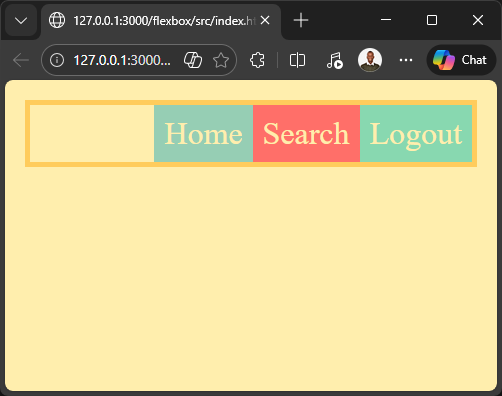

Content moves to the end of the main axis (right side).

### Center

```css
.container {
  border: 5px solid #ffcc5c;
  display: flex;
  flex-direction: row;
  justify-content: center;
}
```

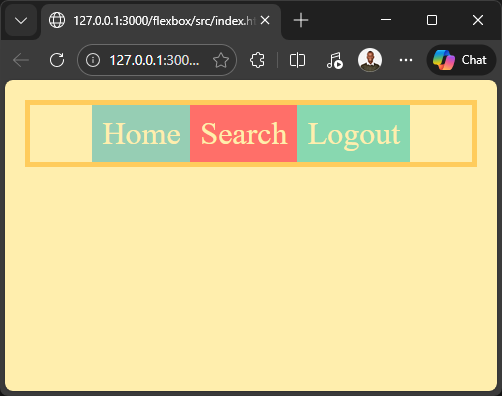

Content is centered along the main axis.

### Space-Around

```css
.container {
  border: 5px solid #ffcc5c;
  display: flex;
  flex-direction: row;
  justify-content: space-around;
}
```

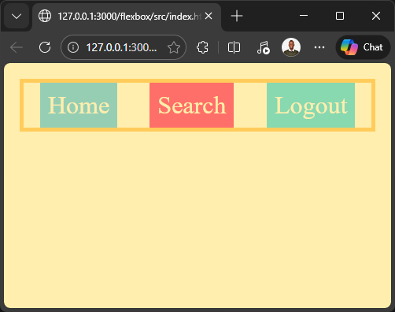

Each item gets equal space on its left and right sides. Notice that the space between two adjacent items is twice as wide as the space at the edges, because the spacing from each item combines.

### Space-Between

```css
.container {
  border: 5px solid #ffcc5c;
  display: flex;
  flex-direction: row;
  justify-content: space-between;
}
```

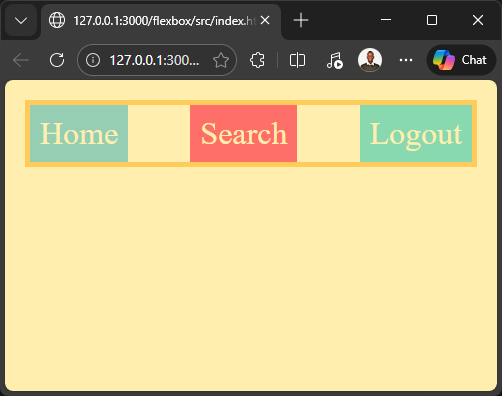

Items are evenly distributed with the first item at the start and the last item at the end.

### Space-Evenly

```css
.container {
  border: 5px solid #ffcc5c;
  display: flex;
  flex-direction: row;
  justify-content: space-evenly;
}
```

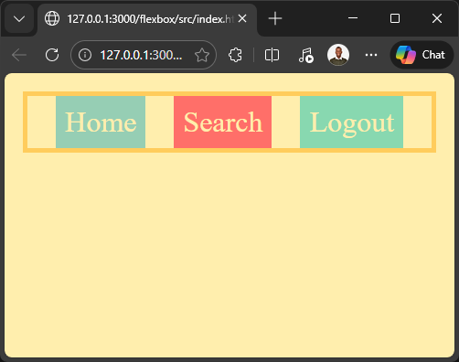

Items are distributed with equal space between them and at the edges.

---

## 4. Positioning Individual Items

While `justify-content` values are useful, they don't always provide the exact layout you need. For instance, you might want _Home_ and _Search_ on the left, with _Logout_ on the right.


This specific arrangement can't be achieved with `justify-content` alone.

### Using Margin Auto

The traditional technique of `margin-[direction]: auto` works perfectly with Flexbox.

Starting with the default layout (items on the left):

```css
.container {
  border: 5px solid #ffcc5c;
  display: flex;
}
```


### Adding Class Names

First, add class names to target specific items:

```html
<html>
  <head>
    <link rel="stylesheet" href="basic.css" />
    <link rel="stylesheet" href="index.css" />
  </head>
  <body>
    <div class="container">
      <div class="home">Home</div>
      <div class="search">Search</div>
      <div class="logout">Logout</div>
    </div>
  </body>
</html>
```

### Pushing Logout to the Right

```css
.container {
  border: 5px solid #ffcc5c;
  display: flex;
}

.logout {
  margin-left: auto;
}
```

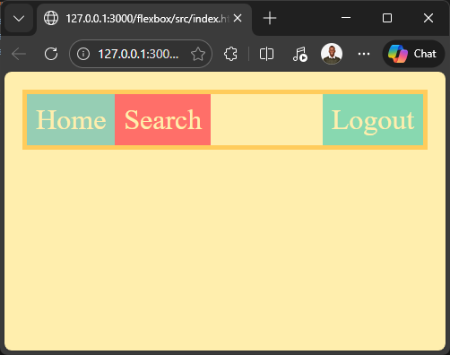

The `margin-left: auto` pushes the logout item all the way to the right. The space shown is the left margin of the logout item.

### Pushing Multiple Items to the Right

To move both _Search_ and _Logout_ to the right, apply the margin to _Search_ instead:

```css
.container {
  border: 5px solid #ffcc5c;
  display: flex;
}

.search {
  margin-left: auto;
}
```

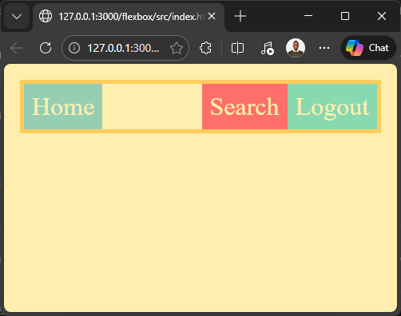

Since _Search_ appears before _Logout_ in the markup, adding `margin-left: auto` to _Search_ pushes both items to the right.

**Key Takeaway:** This is the standard approach for positioning individual items along the main axis in Flexbox.

---

## 5. The Flex Property

The `flex` property allows you to set item widths relative to the container width, making them responsive. Unlike fixed-width items, these grow and shrink with the container.

### Basic Usage

To make all items stretch across the entire container:

```css
.container {
  border: 5px solid #ffcc5c;
  display: flex;
}

.search {
  margin-left: auto;
}

.container > div {
  flex: 1;
}
```

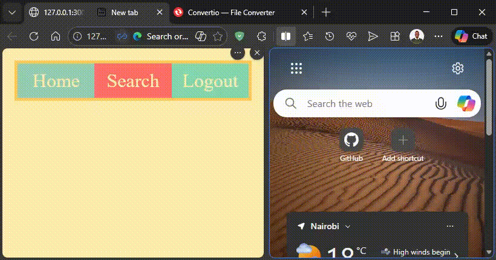

All items now take up equal space (one-third each) and grow/shrink with the container.

### Understanding Flex as a Shorthand

`flex` is actually shorthand for three properties:

- `flex-grow`
- `flex-shrink`
- `flex-basis`

These will be covered in depth later. For now, focus on using `flex` in its simplified form.

### Flex vs. Percentage Width

The old approach using percentages:

```css
.container {
  border: 5px solid #ffcc5c;
  display: flex;
}

.search {
  margin-left: auto;
}

.container > div {
  width: 33.33333%;
}
```

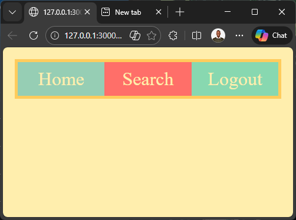

**Problem:** You must recalculate percentages whenever you add or remove items.

**Flex Solution:** Flexbox automatically handles the math for any number of items.

### Adding a Fourth Item

With `flex: 1`, adding items is seamless:

```css
/* basic.css - Add styling for fourth item */
.container > div:nth-child(4) {
  background-color: #ff6f69;
}
```

```css
/* index.css */
.container {
  border: 5px solid #ffcc5c;
  display: flex;
}

.search {
  margin-left: auto;
}

.container > div {
  flex: 1;
}
```

```html
<!-- index.html -->
<html>
  <head>
    <link rel="stylesheet" href="basic.css" />
    <link rel="stylesheet" href="index.css" />
  </head>
  <body>
    <div class="container">
      <div class="home">Home</div>
      <div class="search">Search</div>
      <div class="logout">Logout</div>
      <div class="profile">Profile</div>
    </div>
  </body>
</html>
```

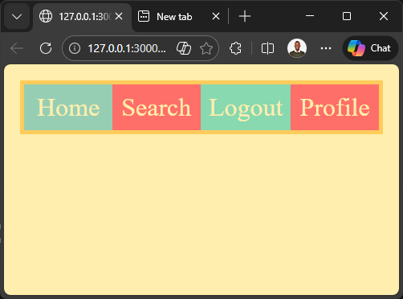

Flexbox automatically allocates 25% to each item, and they remain responsive.

### Targeting Specific Items

To make _Search_ twice as wide as other items:

```css
.container {
  border: 5px solid #ffcc5c;
  display: flex;
}

.container > div {
  flex: 1;
}

.container > .search {
  flex: 2;
}
```


### CSS Specificity Note

Why use `.container > .search` instead of just `.search`?

```css
/* More specific selector (class + tag) - takes priority */
.container > div {
  flex: 1;
}

/* Less specific (just class) - would be overridden */
.search {
  flex: 2;
}
```

The selector `.container > div` is more specific than `.search` alone, so its styling takes precedence. Using `.container > .search` ensures your styling applies correctly.

### Practical Use Case: Fixed Width with One Flexible Item

A more realistic pattern is having one flexible item while others maintain fixed widths:

```css
.container {
  border: 5px solid #ffcc5c;
  display: flex;
}

.search {
  flex: 1;
}
```

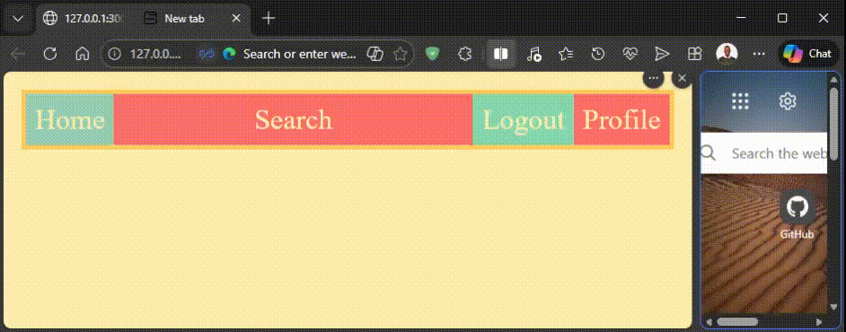

Now:

- _Home_, _Logout_, and _Profile_ have fixed widths
- _Search_ grows and shrinks with the container width

This pattern is extremely common in real-world layouts (e.g., navigation bars with a search input that expands/contracts).

---

## Summary

**Flexbox Fundamentals:**

1. Use `display: flex` to activate Flexbox on a container
2. Understand main axis (horizontal by default) and cross axis (vertical by default)
3. Use `justify-content` to distribute items along the main axis
4. Use `margin: auto` to position individual items
5. Use the `flex` property to create responsive, flexible layouts

**Common Patterns:**

- Equal-width items: `flex: 1` on all items
- Proportional widths: Different flex values (e.g., `flex: 1` and `flex: 2`)
- Fixed + flexible: Apply `flex` only to items that should grow/shrink
